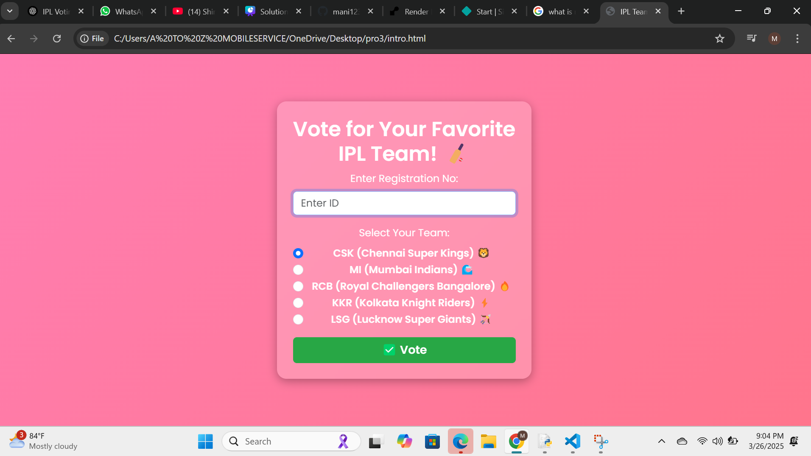

# voting-system
Build a mini voting system using css,js,html .As a first year student we can't able to implement the biometry verification and finger print verification in it.we have many future idea to implement in it.you can replace the registory number with the voter id numbers and we can able to add the otp system in it.For more security we can add the 
OTP system with the Aadhar number .Because the OTP will be send to the respected phone number which is linked with Aadhar.we can see the result immediately!!

---
## 📸 Screenshot  

---
# IPL Team Voting Machine 🏏

A simple web-based voting system where users can vote for their favorite **Indian Premier League (IPL) team**. It ensures fairness by verifying registration numbers and preventing duplicate votes.

---

## 🚀 Features
✅ **User Authentication** – Voters must enter a valid registration number.  
✅ **Unique Voting** – A user can vote only once.  
✅ **Live Vote Count** – The system records and counts votes in real-time.  
✅ **Stylish UI** – A modern and responsive interface with animations.  
✅ **Voting Completion Alert** – Displays final results when all registered users have voted.  

---

## 🛠️ Technologies Used
- **HTML** – Structure of the voting system.  
- **CSS & Bootstrap** – Styling and responsiveness.  
- **JavaScript** – Handles voting logic, validation, and animations.  

---

## 📌 How It Works
1. **User Enters Registration Number**  
   - Only predefined registration numbers (101–108) are accepted.  
   - Invalid or non-numeric IDs trigger an alert.  

2. **User Selects an IPL Team**  
   - Teams available for voting:
     - 🦁 CSK (Chennai Super Kings)  
     - 🌊 MI (Mumbai Indians)  
     - 🔥 RCB (Royal Challengers Bangalore)  
     - ⚡ KKR (Kolkata Knight Riders)  
     - 🏹 LSG (Lucknow Super Giants)  

3. **Vote Submission**  
   - If everything is correct, the vote is recorded, and the user gets a success message.  
   - If the user tries to vote again, an alert prevents duplicate voting.  

4. **Final Voting Results**  
   - Once all registered users have voted, a pop-up shows the total votes per team.  

---

## 🎯 Future Enhancements
- **Database Integration** – Store votes permanently.  
- **More Teams** – Add all IPL teams.  
- **Live Vote Dashboard** – Display real-time vote counts.  
- **Mobile App Version** – Convert this into an app for easier access. 

---
